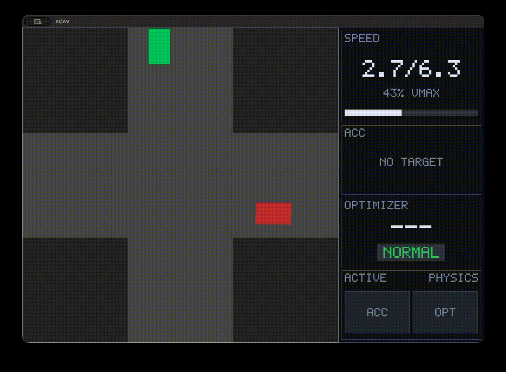
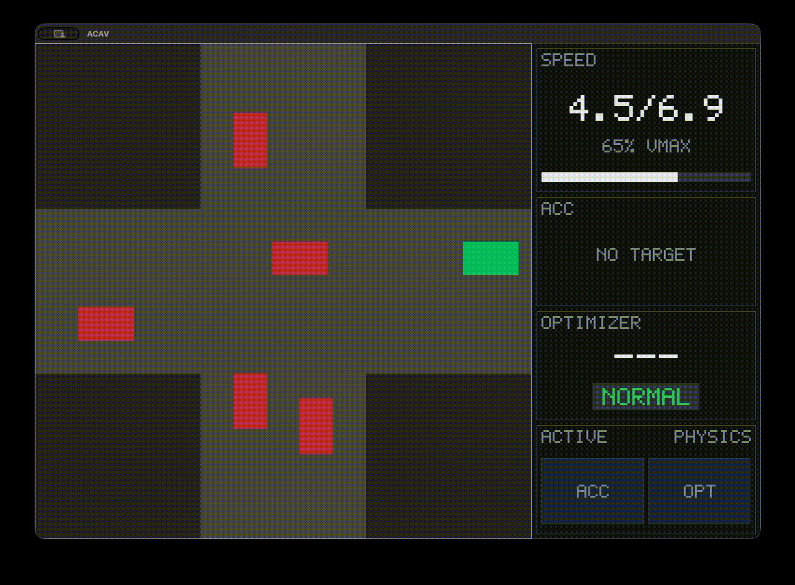
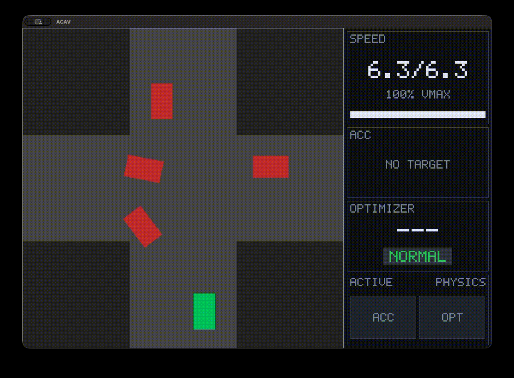

# Autonomous Driving Project (ACAV @ Polimi, 2025-2026)

Final project for Automation and Control for Autonomous Vehicles (ACAV), held at Polimi in the Mathematical Engineering MSc.

---

## Project Overview

A real-time simulator of a four-way intersection, written in C++23 using SDL2 for rendering. The scene is a square grid of configurable size, every geometric quantity in the code is expressed as a fraction of that size, so the whole simulation rescales with a single parameter.

Two classes of agent share the road:

- **CPU vehicles**, which negotiate the junction through a centralised `IntersectionCoordinator`. The coordinator maintains a queue, resolves right-of-way, and issues speed suggestions derived from a precomputed conflict table between all pairs of routes.
- **The ego vehicle**, which is autonomous. It never queries the coordinator and never receives commands from it. Every decision it takes comes from its own perception–planning–control stack.

This asymmetry is the core of the project: the ego must survive an intersection whose other participants are coordinating among themselves, using only what it can observe.

### Vehicle model and global planning

All vehicles share a kinematic bicycle model integrated with adaptive sub-stepping, so the discretisation error stays bounded independently of speed. Lateral acceleration limits are enforced through a curvature-dependent speed cap, and longitudinal acceleration is saturated.

Routing is handled by twelve global plans, three possible manoeuvres (going straight, short turn, long turn) from each of the four approach legs. Each plan is a waypoint polyline and a pure-pursuit controller tracks it.

### Ego vehicle stack

The ego runs two controllers, each producing a speed request, obtaining information from two sensing tools:

**Sensing**

- **Perception**: builds a relative view of the scene. For every other vehicle it gives its relative bearing, distance, and a state describing where it sits with respect to the junction (approaching, inside, leaving, outside).
- **Motion prediction**: maintains a short history of each observed vehicle's speed and extrapolates its position over a finite horizon, together with the ego's own predicted pose. This is a second (future) perception snapshot that the controllers can compare against the present one.

**Control**

- **Adaptive Cruise Control**: tracks a lead vehicle in the ego's corridor, regulates the gap, and falls back to emergency braking when the gap collapses (or when a vehicle is detected within a very close distance).
- **Optimizer**: a finite state machine (`NORMAL`, `REQUESTING_STOP`, `STOPPED`, `RESTART`) governing vehicle behaviour. It implements right-of-way reasoning, occupancy checks on the junction area, and a mechanism that always check if the vehicle is going to crash soon.

The two controllers run independently and the lower of their speed requests wins.


### Simulator

`Simulator` owns the map, the renderer and the clock. Each tick it advances the world by one step, redraws, and checks for termination.

The grid carries only occupancy and rendering. Traffic is generated stochastically at the four legs, subject to a clearance check at the spawn point, with a randomised maximum speed per vehicle; vehicles retire at the end of their plan and the scene runs indefinitely.

Two conditions end a run: a **collision**, detected as an overlap between vehicle footprints, and a **deadlock**, declared when every vehicle has been stationary for a certain interval. Both write a timestamped screenshot of the final frame, telemetry panel included. The simulation can also be paused live (using `Space`).

---

## Demo



*Ego vehicle (green) performs a straight line, stopping to give precedence to a right-coming vehicle.*



*Ego vehicle (green) performs a straight line, initially stopping due to a vehicle approaching the junction on the right.*



*Ego vehicle (green) performs a left-hand turn.*

---

## Repository Structure

```
src/
├── misc/
│   ├── GIFs/                           Demo recordings
│   ├── CollisionMatrix_generator.py    Generates the route conflict table
│   ├── GlobalPlans_plotter.py          Plots the twelve routes
│   └── mp_validation.py                Motion prediction error analysis
│
├── main.cpp                            Entry point
├── Simulator.{h,cpp}                   Main loop, spawning, crash and deadlock detection
├── Map.{h,cpp}                         Grid, occupancy, vehicle registry
├── Point.{h,cpp}                       Grid cell
├── Point_type.h                        Cell classification
├── Vehicle.{h,cpp}                     Base vehicle functions
├── CPUVehicle.{h,cpp}                  Coordinator-driven vehicle
├── EgoVehicle.{h,cpp}                  Autonomous vehicle, arbitration between ACC and Optimizer
├── GlobalPlan.{h,cpp}                  The twelve routes
├── IntersectionCoordinator.{h,cpp}     Right-of-way, queueing, route conflict table (for CPUs)
├── Perception.{h,cpp}                  Relative view of the scene
├── MotionPrediction.{h,cpp}            Finite-horizon extrapolation
├── AdaptiveCruiseControl.{h,cpp}       Longitudinal control, gap regulation, emergency braking
├── Optimizer.{h,cpp}                   Longitudinal control, FSM
├── FSM.h                               FSM states
├── SDLRenderer.{h,cpp}                 Rendering
├── HUD.{h,cpp}                         Telemetry panel
├── EgoTelemetry.{h,cpp}                Ego state exposed to the renderer
└── CMakeLists.txt
```

---

## Building and Running

### Requirements

- C++23 compiler
- CMake
- SDL2 and SDL2_image

On macOS:

```bash
brew install sdl2 sdl2_image cmake
```

On Debian/Ubuntu:

```bash
sudo apt install libsdl2-dev libsdl2-image-dev cmake build-essential
```

### Build

```bash
cmake -S src -B build
cmake --build build -j
```

### Run

```bash
./build/ACAV
```

### Controls

| Key | Action |
|-----|--------|
| `Space` | Pause / resume |
| `Esc` or window close | Quit |

### Configuration

The two parameters worth changing are in `main.cpp`:

```cpp
constexpr int GUI_SIZE = 800;    // window height in pixels
constexpr int map_size = 1350;   // simulation grid size (needs to be a multiple of 135)
```

---